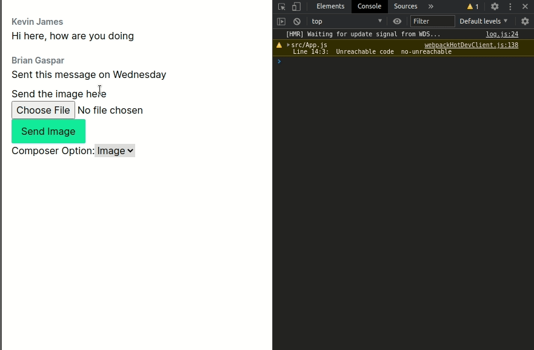

A fun project, that tries to take a different approach from community loved [react-native-gifted-chat]() when handling state and actions.

Only dependecies (hopefully) are:
  - [use-context-selector@1.3.7](https://github.com/dai-shi/use-context-selector)
  - [immer@8.0.1](https://github.com/immerjs/immer)

## Get Started

Currently without Typescript support, to use the package

```bash
yarn add react-chat-potato
```

And follow through the [Usage](#usage) section

## Underlying Concepts and Principles

### Concepts:
Building this project, there are differnent things that are taken to consideration when building a chat.
It's that:
-  You want to know the information around the general conversation (global context)
- You want to be able to show messages accounting for different types (text, images, videos, signature, whatever else that might popup in the future...)
- You want to be able to use different inputting methods for different types of data

This packages tries to get close to addressing some these things by building around having 3 things, which are being internally supported within this project:
- Global Context
- MessageCanvas
- ComposerBox


(...more on these later)

Principles:
- Modularity and high customizability (using inner component through use of hooks)
- Nothing is served for primary use (though there are things that are provided as example components)
- Can be used with both `React` and `ReactNative` environments

## Things to try to play around with: 
(I should probably move this to Github Project)

- [x] **Enabling Customizable Composers**: You are able to build composer components depending on your use case. For instance: text area for text input, custom audio mic for audio input. See Usage example
    
    
- [ ] Using delta datetime _[on progress]_ (and having only one reference for time)
- [ ] publish version `0.1.x` 
- [ ] Wrapping with placeholder view component (not to pick sides btn RJS / RN)
- [ ] Adding a default components package with theme
- [ ] Support Typescript

## Usage

`./custom-components/index.js`
```tsx
import { useSendCallback } from 'react-chat-potato/dist/lib/utils';

function ImageComposer ({ composerType, sendAction }) {
    const [fileValue, setFile] = useState("")

    const onSend = useSendCallback(fileValue, composerType, sendAction)
    return (
        <div>
            <div>Send the image here</div>
            <input type="file" value={fileValue} onChange={(e) => setFile(e.target.value)}/>
            <button onClick={onSend} className="bg-green-400 px-4 py-2 rounded-sm">
                Send Image
            </button>
        </div>
    )
}
    

function TextComposer ({ composerType, sendAction }) {
    const [value, setValue] = useState("")
    const onSend = useSendCallback(value, composerType, sendAction)

    return (
        <div className="w-full justify-start flex items-start gap-4">
            <textarea className="border w-96" value={value} onChange={(e) => setValue(e.target.value)}/>
            <button onClick={onSend} className="bg-green-700 px-4 py-2 rounded-sm">
                Send
            </button>
        </div>
    )
}
```
<br />

`index.js`
```tsx
import { PotatoChat } from 'react-chat-potato'
import { ImageComposer, TextComposer } from './custom-components';

const globalChatContext = {
    dateTime: Date.now(),
    users: {
        'self': null,   // TODO: this should indicate that user can chat
        'kevin': {
            name: "Kevin James",
        },
        'brian': {
            name: "Brian Gaspar"
        }
    }
}

const messages = [
    {
        input: "Hi here, how are you doing", 
        dateTimeDelta: 129122762,
        user: 'kevin'
    },
    { 
        input: "Sent this message on Wednesday", 
        dateTimeDelta: 215617315,
        user: 'brian'
    }
]

/**
 * Composer Component details
 */
const composerOptions = {
    composerType: 'text', 
    composerOptions: {
        'text': { component: TextComposer },
        'image': { component: ImageComposer },
    }
}


export default function ChatBox() {
    const sendAction = async (input, composerType) => {
        console.log("Send message:", input)
        console.log("ComposerType:", composerType)

        switch (composerType) {
            case 'text': console.log(">> Text based message"); break;
            case 'image': console.log(">> Image based message"); break;
            default: console.log("DEFAULT MESSAGE TRANSFER")
        }
    }

    return (
        <PotatoChat 
            initialComposer='image'
            initialMessages={messages}
            globalChatContext={globalChatContext}
            composerConfig={composerOptions}
            sendAction={sendAction} />
    )
}
```

### GIF




## License

This project uses an [MIT License](LICENSE). So take it apart, build it. Do whatever you want with this project.

But Contributions are welcomed
